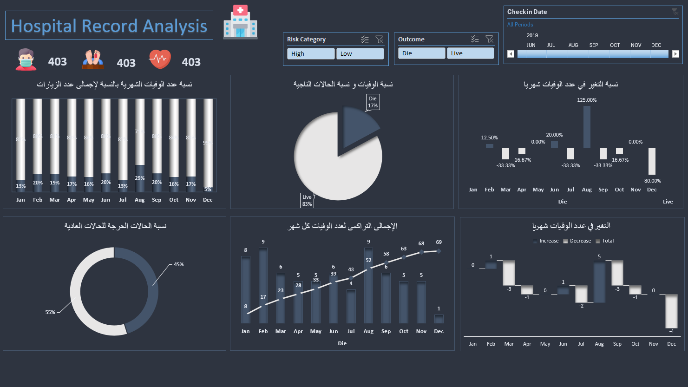

# Hospital Record Analysis Dashboard

## Project Description

This project analyzes hospital records data using **Microsoft Excel only**.
The dashboard was created using Excel tools such as data cleaning, pivot tables, and charts to visualize key insights related to hospital performance and patient records in a clear and interactive way.

## 🖼 Dashboard Preview

## 🎯 Objectives

* Analyze hospital records to identify trends and patterns.
* Track key performance indicators (KPIs) such as patient count, admissions, and department workload.
* Provide clear visualizations to help stakeholders understand the data easily.

## 🛠 Tools & Technologies

* **Microsoft Excel** (Data Cleaning & Analysis)
* **Pivot Tables & Charts**
* **Interactive Dashboard**

## 📈 Dashboard Features

* Overview of total patients and admissions.
* Analysis by department and time period.
* Visual representation of key insights using charts and tables.

## 🖼 Dashboard Preview

## 📌 Conclusion

This dashboard provides a clear and interactive view of hospital records, helping decision-makers monitor performance, identify bottlenecks, and improve operational efficiency.

---

**Author:** Mohamed Hosny
